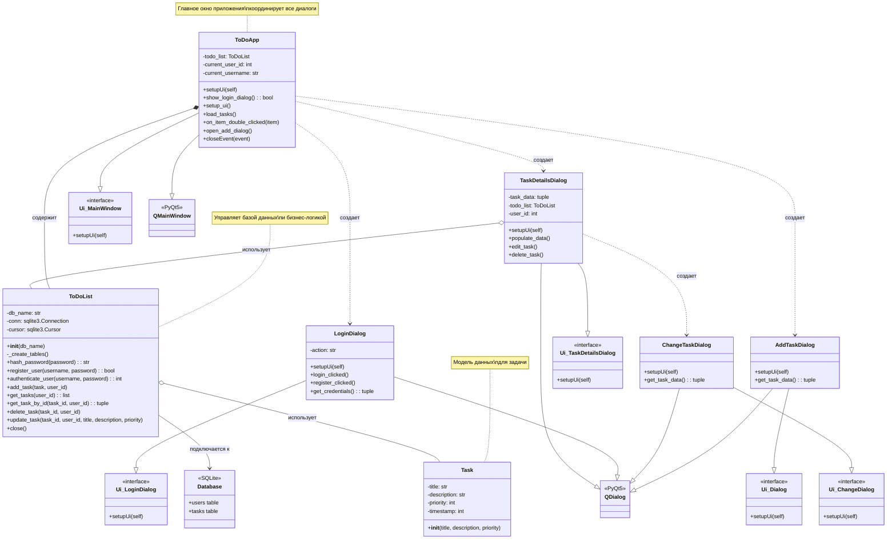

# UML Диаграмма классов - ToDo List Application

## Описание архитектуры:

### 1. **Модель данных (Data Model)**
- `Task`: Простая модель данных для задачи

### 2. **Слой данных (Data Layer)**
- `ToDoList`: Управляет всеми операциями с базой данных SQLite
- Обеспечивает аутентификацию пользователей
- Выполняет CRUD операции для задач

### 3. **Слой представления (Presentation Layer)**
- `ToDoApp`: Главное окно приложения
- `LoginDialog`: Диалог входа/регистрации
- `AddTaskDialog`: Диалог добавления новой задачи
- `ChangeTaskDialog`: Диалог редактирования задачи
- `TaskDetailsDialog`: Диалог просмотра деталей задачи

### 4. **UI Интерфейсы**
- Сгенерированные из QtDesigner .ui файлов
- Определяют внешний вид интерфейса

### 5. **Основные паттерны проектирования:**
- **MVC (Model-View-Controller)**: Разделение данных, представления и логики
- **Singleton**: ToDoList как единый менеджер базы данных
- **Factory**: Создание различных диалогов по требованию
- **Observer**: PyQt signals/slots для обработки событий
